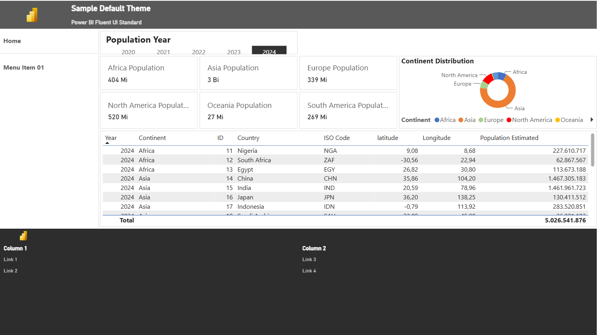
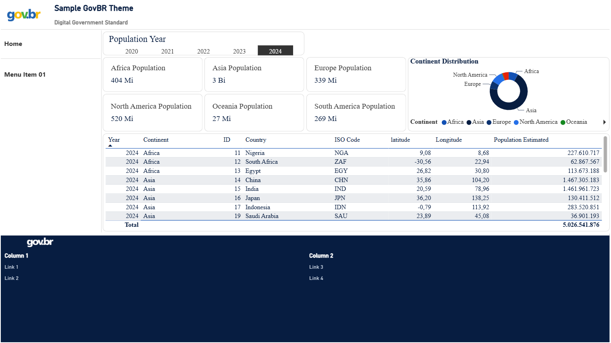

# pbi-grid

A Dashboard-as-Code (DaC) tool that compiles declarative YAML layouts into Power BI PBIR reports using a deterministic 12-column grid layout engine.

Define report layouts in YAML using rows and a 12-column grid, and generate a complete `.Report` folder automatically. Visual positions are computed from row heights and column spans with no manual coordinate editing required.

It also includes an extensible design-token-based theming system, including a reference govBR design package.

---

<table>
<tr>
<td align="center"><b>default</b><br><a href="themes/default/preview.PNG"></a></td>
<td align="center"><b>govbr</b><br><a href="themes/govbr/preview.PNG"></a></td>
</tr>
</table>

---

## In production: CAPES — Agenda Nacional

PBI Grid powers the **Agenda Nacional de Capacidades (Capacity)** dashboard published by CAPES (Brazilian Federal Agency for Support and Evaluation of Graduate Education), launched in June 2026.

- 🌐 **Live dashboard:** [agendanacional.capes.gov.br/capacity](https://agendanacional.capes.gov.br/capacity)
- 🎥 **Launch video:** [youtube.com/watch?v=_Y6lg1ShRow](https://www.youtube.com/watch?v=_Y6lg1ShRow)

The CAPES report was generated with PBI Grid applying the govBR design package, demonstrating the tool in a real public-sector deployment.

---

## Publications

> 📄 **Paper:** *PBI Grid: A Dashboard as Code Tool for Enhancing Maintainability and GovBR Compliance in Power BI Reports* — manuscript submitted to the Brazilian Symposium on Software Engineering (SBES) 2026, under review.

| Resource | Link |
|---|---|
| 🎬 Demo video | [youtu.be/3WtDYCx9z-k](https://youtu.be/3WtDYCx9z-k) |
| 📦 Archived release (Zenodo DOI) | [10.5281/zenodo.20382780](https://doi.org/10.5281/zenodo.20382780) |

---

## Requirements

- Python 3.11+
- [PyYAML](https://pypi.org/project/PyYAML/)

---

## Setup

```bash
git clone <repo-url>
cd pbi-grid

# Create virtual env
python3 -m venv .venv

# Activate (macOS / Linux)
source .venv/bin/activate
# Activate (Windows)
.venv\Scripts\activate

# Install
pip install -e .

# Verify
pbi-grid --help
```

---

## Typical workflow

The example below uses the included `examples/countries_population` report. The same steps apply to any PBIR report.

### 1 — Extract a layout from an existing report

```powershell
pbi-grid extract `
  --report examples/countries_population/source/countries_population.Report `
  --output output/layout/layout.yaml
```

Reads the `.Report` folder and generates a layout YAML. The algorithm:

1. Reads absolute visual positions from each `page.json`.
2. Clusters Y values (within 5 units) to identify row bands.
3. Computes `span` from visual width divided by one column unit (`canvas_width / 12`), rounded.
4. Sorts visuals left-to-right within each row and emits the `rows → cols` structure.

Each visual is identified by its 20-char PBIR name and becomes a `name:` col in the YAML.

### 2 — Add components with scaffold

```powershell
pbi-grid scaffold --layout output/layout/layout.yaml
```

An interactive wizard that guides you through:

- **Theme selection** — `default` or `govbr` (sets `package:` and applies visual defaults).
- **Component configuration** — header, footer, and/or menu. Prompts for title, items, orientation, and row placement.
- **Auto-fit** — adjusts row heights and col spans so the inserted components don't overflow the grid.

See the [Scaffold reference](#scaffold) below for full details.

### 3 — Debug the grid layout

```powershell
pbi-grid generate `
  --layout output/layout/layout.yaml `
  --output output/countries_population `
  --debug-grid
```

Renders a visual debug layer on every page: each grid cell gets a semi-transparent blue fill and an orange label in the format `name:<last5> - pos: <row> row * <col> col`. Use this to verify boundaries before connecting real data.

### 4 — Generate the final report

```powershell
pbi-grid generate `
  --layout output/layout/layout.yaml `
  --output output/countries_population
```

Produces a `.Report` folder ready to open in Power BI Desktop. When `report.source` is set in the YAML, visual bindings, filters, and formatting are preserved from the source — only positions change.

### 5 — Merge extract (add new visuals without losing edits)

```powershell
pbi-grid extract `
  --report examples/countries_population/source/countries_population.Report `
  --merge output/layout/layout.yaml
```

Re-extracts without overwriting pages already present in the YAML:

| Case | Result |
|---|---|
| New page | Fully extracted and appended |
| Existing page, no new visuals | Preserved verbatim |
| Existing page, new visuals | Existing config kept; new visuals appended as rows |

---

## Layout YAML reference

### Top-level keys

```yaml
package: govbr           # Theme: default | govbr (optional)

report:
  name: MyReport         # Output .Report folder name (default: layout filename stem)
  source: ./MyReport.Report  # Source report — preserves visual data (optional)

canvas:
  width: 1280            # Canvas width in Power BI units (default: 1280)
  height: 720            # Canvas height (default: 720)
  gutter: 4              # Half-gap between cells in units (default: 0)

shared:
  components:            # Named reusable col definitions — referenced via ref:
    page_header:
      span: 12
      component: header
      title: "My Report"
      subtitle: "Organization"

pages:
  - id: <pbir-page-id>   # 20-char hex PBIR page ID
    display_name: Home
    rows: [...]
```

**Page IDs** must be stable 20-char hex strings — use the existing PBIR folder name from `extract`, or any deterministic hex string for new pages.

### Rows and columns

```yaml
rows:
  - id: content
    height: 120          # Row height in canvas units
    border: true         # Render a border shape around the entire row (optional)
    cols:
      - span: 4          # Column span (1–12)
        visual: barChart # Create a new bare visual of this PBI type
      - span: 4
        name: a1b2c3d4e5f6a7b8c9d0  # Reposition an existing visual by PBIR ID
      - span: 2
        component: menu  # Built-in component
        rowspan: 3       # Extend this col across N rows vertically (default: 1)
        border: true     # Render a border shape behind this cell (optional)
        height: 30       # Override visual height within the cell (optional)
        valign: center   # Vertical alignment: top | center | bottom (default: top)
      - ref: page_header # Expand a shared component inline
        rowspan: 2       # Local overrides take precedence over the shared definition
```

**`name` vs `visual`**

| Field | When to use |
|---|---|
| `name` | Reposition an existing visual from the source report by PBIR ID. |
| `visual` | Create a new bare visual of the given Power BI type. |

### Column span → width (1280 canvas)

| `span` | Width (units) |
|--------|--------------|
| 1 | 106.67 |
| 2 | 213.33 |
| 3 | 320.00 |
| 4 | 426.67 |
| 6 | 640.00 |
| 8 | 853.33 |
| 10 | 1066.67 |
| 12 | 1280.00 |

### Shared rows

A `shared.rows` entry injects its cols into the matching page rows across every page. Pages that have no row with that ID get a new row inserted at the top.

```yaml
shared:
  rows:
    - id: header_row
      height: 64
      cols:
        - ref: page_header
```

---

## Components

### `header`

Full-width header bar: background rectangle, title, optional subtitle, and an optional accent stripe at the bottom.

```yaml
- span: 12
  component: header
  title: "My Report"
  subtitle: "Organization Name"   # optional
```

| Visual | Type | Description |
|---|---|---|
| background | `shape` | Colored rectangle (`header.background_color`) |
| title | `actionButton` | Main title text |
| subtitle | `actionButton` | Secondary label (only when `subtitle:` is set) |
| accent bar | `shape` | Bottom stripe (`header.accent_color`, `header.accent_height`) |

---

### `menu`

Navigation menu where each item is an `actionButton` that navigates to the target page.

**Menu height is content-driven**, not rowspan-driven: the background sizes to `items × menu.item_height` (token). The `rowspan` controls grid space reservation, not the visual height.

**Flat menu:**

```yaml
- span: 2
  component: menu
  orientation: vertical
  items:
    - page: Home
      description: "Landing page"
    - page: Details
      description: "Detailed breakdown"
```

**Two-level menu (group headers + child items):**

Items with a nested `items:` list render as non-clickable section headers; children render as indented buttons.

```yaml
- span: 2
  component: menu
  orientation: vertical
  items:
    - page: Overview
      description: "Summary"
    - page: By Theme
      items:
        - page: Topic A
          description: "Topic A"
        - page: Topic B
          description: "Topic B"
```

**Separator:**

```yaml
    - separator: true
```

---

### `footer`

Full-width footer bar: background, optional top divider stripe, optional logo, site-map link columns, and a legal text bar at the bottom.

> **Layout tip:** place the footer row **outside** the `menu` rowspan so it spans all 12 columns.

```yaml
- span: 12
  component: footer
  logo_path: "govbr.png"    # filename relative to the theme dir (optional)
  logo_height: 40           # px — overrides tokens footer.logo_height (optional)
  legal: "License and usage terms."
  links:
    - title: "CATEGORY"
      items:
        - label: "Link label"
          url: "https://example.com"
        - label: "Another link"
          url: "https://example.com"
```

**Footer layout (top → bottom):**

```
┌── top divider stripe (divider_height px) ────────────────┐
│ logo (logo_width × logo_height)                           │
├── link columns (full width, remaining height) ────────────┤
│ CATEGORY      CATEGORY      CATEGORY                      │
│  link          link          link                         │
├── 1px separator ──────────────────────────────────────────┤
│ Legal text                         (legal_height px)      │
└───────────────────────────────────────────────────────────┘
```

**Minimum footer height** = `divider_height + logo_height + (items + 1) × item_height + 1 + legal_height`

| Visual | Type | Description |
|---|---|---|
| background | `shape` | Full-width rectangle (`footer.background_color`) |
| top divider | `shape` | Accent stripe (`footer.divider_color`) |
| logo | `image` | PNG from theme dir (`RegisteredResources`) |
| column title × N | `actionButton` | Category header, bold, no action |
| link × M | `actionButton` | Site-map link, opens web URL |
| separator | `shape` | 1px line above legal bar |
| legal text | `actionButton` | License/terms text, no action |

---

## Themes

Select a theme with `package:` in the layout YAML.

```yaml
package: govbr
```

---

### `default`

Neutral — no brand identity. Gray tones throughout. Suited as a starting point for any organization.


---

### `govbr`

Brazilian federal government — [Padrão Digital de Governo](https://www.gov.br/ds/home). Navy/white/blue palette.


---

Each theme lives under `themes/{name}/` and provides:

- `tokens.yaml` — design tokens (colors, sizes, font sizes per component)
- `visual_defaults.yaml` — default `border`, `valign`, and component options applied automatically by `scaffold`
- `imgs/` — logo and icon assets

### Tokens (`tokens.yaml`)

Tokens are the source of truth for all component colors and dimensions. Component props in the layout YAML (e.g. `logo_height`, `logo_path`) override the corresponding token when set.

```yaml
header:
  background_color: "#071D41"
  title_color: "#FFFFFF"
  title_font_size: 14
  subtitle_color: "#DDDDDD"
  subtitle_font_size: 10
  accent_color: "#1351B4"
  accent_height: 2

footer:
  background_color: "#071D41"
  divider_color: "#FFFFFF"
  divider_height: 4
  logo_path: govbr.png
  logo_width: 165
  logo_height: 60
  title_color: "#FFFFFF"
  title_font_size: 10
  link_color: "#C9D4E3"
  link_font_size: 9
  item_height: 24
  legal_color: "#A8B5C3"
  legal_font_size: 9
  legal_height: 44

menu:
  item_height: 48
  background_color: "#FFFFFF"
  divider_color: "#E0E0E0"
  divider_weight: 1
  item:
    font_color_default: "#1351B4"
    font_color_selected: "#FFFFFF"
    fill_color_default: "#F8F8F8"
    fill_color_selected: "#0C326F"
    outline_color: "#1351B4"

layout:
  border_color: "#E0E0E0"
  border_weight: 1
  border_radius: 0
```

---

## Scaffold

`scaffold` is an interactive wizard that adds components (header, footer, menu) to an extracted layout YAML — avoiding manual YAML editing for the first setup.

```bash
pbi-grid scaffold --layout output/layout/layout.yaml
```

**Phase 1 — Theme**

Prompts to set or change `package:`. When a theme is selected, `visual_defaults.yaml` is loaded and its `border`, `valign`, and canvas settings are applied to existing cols that match a known visual type (e.g. `cardVisual`, `barChart`).

**Phase 2 — Components**

Runs one sub-wizard per component selected (header, footer, menu):

| Prompt | Description |
|---|---|
| Shared component name | Key under `shared.components` (default: `page_header`, `page_footer`, `page_menu`) |
| Column span | Grid width of the component (default: 12 for header/footer, 2 for menu) |
| Row height | Height in canvas units for the new row |
| Title / Subtitle | *(header only)* Text content |
| Legal / Links | *(footer only)* Footer content stub |
| Pages and orientation | *(menu only)* Which pages to include as items |
| Insert at top / bottom | *(header, footer)* Where to place the new row on each page |
| Anchor row | *(menu)* Which existing row to anchor the rowspan column to |

For the **menu**, `scaffold` automatically:
- Computes `rowspan` from the total height to cover.
- Adjusts the last covered row's height so the rowspan sum is exact.
- Shrinks overflowing col spans (right-to-left) in covered rows.

**Phase 3 — Validate and save**

Runs `validate_layout` (height and span checks) and writes the updated YAML back to the same file.

---

## Project structure

```
pbi-grid/
├── src/
│   ├── models/            # PBIR domain models (Visual, Page, Report)
│   ├── grid/
│   │   ├── schema.py      # YAML parser → LayoutSpec
│   │   ├── engine.py      # LayoutSpec → Report model
│   │   ├── extractor.py   # .Report folder → layout YAML
│   │   ├── scaffold.py    # Interactive component wizard
│   │   └── renderer.py    # Report model → PBIR files on disk
│   ├── components/
│   │   ├── header.py      # HeaderComponent
│   │   ├── menu.py        # MenuComponent
│   │   └── footer.py      # FooterComponent
│   ├── packages.py        # Theme loader (tokens + assets)
│   └── cli.py             # CLI entry point
├── themes/
│   ├── default/           # Neutral theme (tokens, visual_defaults, imgs)
│   └── govbr/             # GovBR theme (tokens, visual_defaults, imgs)
├── examples/
│   └── countries_population/
│       ├── source/        # Original .Report (SemanticModel + Report)
│       ├── pbi_grid_default_theme_layout.yaml
│       └── pbi_grid_govbr_theme_layout.yaml
├── tests/
│   ├── unit/              # Synthetic-fixture tests (engine, schema, extractor, components)
│   └── integration/       # Golden-file tests against examples/countries_population
├── util/
│   └── update-golden.ps1  # Sync tests/golden/ after a validated generate run
└── pyproject.toml
```

### Running tests

```powershell
# Install dev dependencies
pip install -e ".[dev]"

# Unit tests only (fast, no filesystem)
pytest tests/unit/

# Full suite including integration
pytest

# Exclude integration tests
pytest -m "not integration"
```

---

## License

MIT
